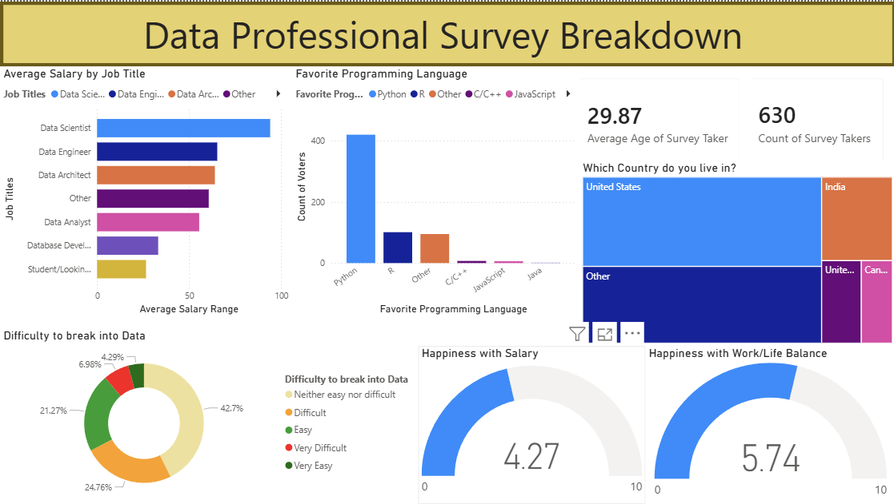

# Data Professional Survey Breakdown 

An interactive Power BI dashboard built from a real-world survey of data professionals worldwide, exploring salary trends, programming preferences, and job satisfaction.

## Dashboard Preview

## Overview
This project analyzes survey responses from **630 data professionals** across multiple countries and job titles, uncovering patterns in compensation, tooling preferences, and workplace satisfaction.

## Key Findings
- **Data Scientists** earn the highest average salaries, followed by Data Engineers and Data Architects
- **Python** is the dominant programming language, preferred by a large majority of respondents
- The **United States** represents the largest share of survey takers, followed by India
- Average happiness with **work/life balance (5.74/10)** is notably higher than happiness with **salary (4.27/10)**
- Over **42%** of respondents found breaking into data "neither easy nor difficult"

## Dashboard Visuals
| Visual | Description |
|--------|-------------|
| KPI Cards | Average age (29.87) and total survey takers (630) |
| Salary by Job Title | Horizontal bar chart comparing avg salary across roles |
| Favorite Programming Language | Bar chart of language preferences by job title |
| Country Treemap | Geographic distribution of survey respondents |
| Difficulty to Break In | Donut chart of perceived entry difficulty |
| Happiness with Salary | Gauge showing avg satisfaction score out of 10 |
| Happiness with Work/Life Balance | Gauge showing avg work/life balance score out of 10 |

## Data Source
- Survey dataset from [Alex The Analyst](https://github.com/AlexTheAnalyst) -  widely used as a Power BI learning dataset
- 630 responses from data professionals across various roles and countries

## Tools Used

- **Power BI Desktop** -  data modeling and visualization
- **Power Query** -  data cleaning and transformation

## How to Use
1. Download the `.pbix` file
2. Open in Power BI Desktop (free download from Microsoft)
3. All data is embedded -  no additional setup needed
